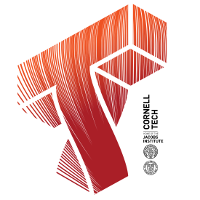

CS 5356: Building Startup Systems (Fall 2017)
===============================================

Essentials
----------

* [Course Slack](https://ct-cs5356-fall2017.slack.com), [Sign-Up](https://ct-cs5356-fall2017.slack.com/signup)
* [Logistics, Location, Class, Office Hours](course/logistics.md)
* [Syllabus](course/syllabus.md)

Lectures
--------

1.  23-Aug: [Git, REST, HTTP, AWS](lectures/lecture-01.md)
2.  30-Sep: [Backend Services, CI, Docker, Launch](lectures/lecture-02.md)
3.  06-Sep: Frontend
4.  13-Sep: *No Class*
5.  20-Sep: Block Storage, Lambda, API's
6.  27-Sep: TBD

Project
--------

We will be building an app that scans receipts, uses OCR to extract cost info, and organizes them.  The app will:
* Support user account creation, login + logout
* Use a restful API between client + server
* Use Google Vison API for OCR

Assignments
----------
1. [Assignment 1](assignments/a1/a1.md)
2. [Assignment 2](assignments/a2/a2.md)

People
------

#### Instructor

* [Adam Fleming](people/adam-fleming.md)

#### Teaching Assistants

* [Rahul Chatterjee](people/rahul-chatterjee.md) - rc737 - [https://typtop.info/grading.html](https://typtop.info/grading.html)

#### Students
<!-- Please keep in Alpha order -->

* [Joe Abi Sleiman](people/joe-abi-sleiman.md) - jba68 - [http://ec2-13-59-90-238.us-east-2.compute.amazonaws.com:8080](http://ec2-13-59-90-238.us-east-2.compute.amazonaws.com:8080)
* [Kripa Agarwal](people/kripa-agarwal.md) - ka467 - [http://ec2-34-204-185-229.compute-1.amazonaws.com:8080](http://ec2-34-204-185-229.compute-1.amazonaws.com:8080) 
* [Subhangi Agarwala](people/subhangi-agarwala.md) - sa2265 - [http://sa2265.s3-website-us-east-1.amazonaws.com/grading.html](http://sa2265.s3-website-us-east-1.amazonaws.com/grading.html)
* [Luke Ahn](people/luke-ahn.md) - la393 - [http://ec2-52-14-214-108.us-east-2.compute.amazonaws.com:8080](http://ec2-52-14-214-108.us-east-2.compute.amazonaws.com:8080)
* [Tanuj Ahuja](people/Tanuj-Ahuja.md) - ta364 - [https://s3.us-east-2.amazonaws.com/ta364/grading.html](https://s3.us-east-2.amazonaws.com/ta364/grading.html)
* [Travis Allen](people/Travis-Allen.md) - twa24 - [http://cozycozart.com.s3-website.us-east-2.amazonaws.com/grading.html](http://cozycozart.com.s3-website.us-east-2.amazonaws.com/grading.html)
* [Raviteja Arikati](people/raviteja-arikati.md) - ra597 - [http://ra597.s3-website.us-east-2.amazonaws.com/](http://ra597.s3-website.us-east-2.amazonaws.com/)
* [Huajun Bai](people/huajun-bai.md) - hb364 - [https://s3.us-east-2.amazonaws.com/cs5356a1/grading.html](https://s3.us-east-2.amazonaws.com/cs5356a1/grading.html) 
* [Devon Bain](people/devon-bain.md) - dwb264 - [http://ec2-13-59-53-125.us-east-2.compute.amazonaws.com:8080](http://ec2-13-59-53-125.us-east-2.compute.amazonaws.com:8080) 
* [Romoli Bakshi](people/romoli-bakshi.md) - rb636 - [https://s3.us-east-2.amazonaws.com/cs5356-rb636/grading.html](https://s3.us-east-2.amazonaws.com/cs5356-rb636/grading.html) 
* [Oluseye Bankole](people/seye-bankole.md) - ob97 - [http://ec2-54-88-146-220.compute-1.amazonaws.com.s3-website-us-east-1.amazonaws.com/grading.html](http://ec2-54-88-146-220.compute-1.amazonaws.com.s3-website-us-east-1.amazonaws.com/grading.html) 
* [Marco Berlot](people/marco-berlot.md) - mb2589 - [http://ec2-52-202-201-59.compute-1.amazonaws.com:8080](http://ec2-52-202-201-59.compute-1.amazonaws.com:8080)
* [Stephen Bongner](people/stephen-bongner.md) - sb2483 - [http://ec2-13-59-91-251.us-east-2.compute.amazonaws.com:8080](http://ec2-13-59-91-251.us-east-2.compute.amazonaws.com:8080)
* [Cameron Boroumand](people/cameron-boroumand.md) - cb596 - [http://cameronboroumand.com.s3-website.us-east-2.amazonaws.com/grading.html](http://cameronboroumand.com.s3-website.us-east-2.amazonaws.com/grading.html)
* [Mikaela Brown](people/mikaela-brown.md) - mb2587 - [https://s3.amazonaws.com/aws-website-mb-u6ygo/grading.html](https://s3.amazonaws.com/aws-website-mb-u6ygo/grading.html)
* [Christopher Caulfield](people/christopher-caulfield.md) - ctc98 - [http://www.caulfield.io.s3-website-us-east-1.amazonaws.com/grading.html](http://www.caulfield.io.s3-website-us-east-1.amazonaws.com/grading.html)
* [Gaurav Chaturvedi](people/gaurav-chaturvedi.md) - gkc24 - [http://ec2-34-248-245-186.eu-west-1.compute.amazonaws.com:8080](http://ec2-34-248-245-186.eu-west-1.compute.amazonaws.com:8080)
* [Yuan Chang](people/yuan-chang.md) - yc2378 - [https://s3.amazonaws.com/yuanchang.com/grading.html](https://s3.amazonaws.com/yuanchang.com/grading.html)
* [Mohit Chawla](people/mohit-chawla.md) - mc2683 - [http://ec2-35-165-244-172.us-west-2.compute.amazonaws.com:8080](http://ec2-35-165-244-172.us-west-2.compute.amazonaws.com:8080) 
* [Young Sang Choi](people/young-sang-choi.md) - yc2376 - [https://s3.amazonaws.com/youngsangchoi.com/grading.html](https://s3.amazonaws.com/youngsangchoi.com/grading.html) 
* [Rom Cohen](people/rom-cohen.md) - rc783 - [http://cs5356-rc783.s3-website.us-east-2.amazonaws.com/grading.html](http://cs5356-rc783.s3-website.us-east-2.amazonaws.com/grading.html)
* [Christy Cui](people/christy-cui.md) - hc935 - [http://ec2-34-231-243-40.compute-1.amazonaws.com:8080](http://ec2-34-231-243-40.compute-1.amazonaws.com:8080)
* [Marika Cusick](people/marika-cusick.md) - mmc265 - [http://ec2-13-59-58-183.us-east-2.compute.amazonaws.com:8080](http://ec2-13-59-58-183.us-east-2.compute.amazonaws.com:8080) 
* [Jonathan Cutler](people/jonathan-cutler.md) - jlc553 - [https://s3.us-east-2.amazonaws.com/cs5356-jlc553/grading.html](https://s3.us-east-2.amazonaws.com/cs5356-jlc553/grading.html) 
* [Junhsiang Liao](people/junhsiang-liao.md) - jl3744 - [http://ec2-18-220-242-51.us-east-2.compute.amazonaws.com](http://ec2-18-220-242-51.us-east-2.compute.amazonaws.com)
* [Huafeng Dai](people/huafeng-dai.md) - hd338 - [http://ec2-13-58-164-217.us-east-2.compute.amazonaws.com](http://ec2-13-58-164-217.us-east-2.compute.amazonaws.com) 
* [Yuhui Dai](people/yuhui-dai.md) - yd229 - [http://18.221.58.242:8080](http://18.221.58.242:8080) 
* [Will Davis](people/will-davis.md) - twd38 - [https://s3.us-east-2.amazonaws.com/www.twd38.website/grading.html](https://s3.us-east-2.amazonaws.com/www.twd38.website/grading.html)
* [Debarun Dhar](people/debarun-dhar.md) - dd599 - [http://dd599.s3-website-us-east-1.amazonaws.com/grading.html](http://dd599.s3-website-us-east-1.amazonaws.com/grading.html)
* [Saliou Diallo](people/saliou-diallo.md) - sdd65 - [http://ec2-54-152-190-159.compute-1.amazonaws.com](http://ec2-54-152-190-159.compute-1.amazonaws.com)
* [Jessie Gao](people/jessie-gao.md) - jg2238 - [https://s3-us-west-2.amazonaws.com/jessiegao-cs5356.com/grading.html](https://s3-us-west-2.amazonaws.com/jessiegao-cs5356.com/grading.html)
* [Ethan Green](people/ethan-green.md) - erg53 - [http://erg53.s3-website-us-east-1.amazonaws.com/grading.html](http://erg53.s3-website-us-east-1.amazonaws.com/grading.html)
* [Zheyuan Gu](people/zheyuan-gu.md) - zg245 - [http://aws-website-guccigu-59k8u.s3-website-us-east-1.amazonaws.com/grading.html](http://aws-website-guccigu-59k8u.s3-website-us-east-1.amazonaws.com/grading.html)
* [Yiyuan Feng](people/yiyuan-feng.md) - yf323 - [http://yeefeng.me.s3-website.us-east-2.amazonaws.com/grading.html](http://yeefeng.me.s3-website.us-east-2.amazonaws.com/grading.html)
* [David Hachuel](people/david-hachuel.md) - dh649 - [http://aws-website-startup-systems-dh-ns6pf.s3-website-us-east-1.amazonaws.com/grading.html](http://aws-website-startup-systems-dh-ns6pf.s3-website-us-east-1.amazonaws.com/grading.html) 
* [Xu Han](people/xu-han.md) - xh325 - [http://ec2-13-59-191-95.us-east-2.compute.amazonaws.com](http://ec2-13-59-191-95.us-east-2.compute.amazonaws.com)
* [Zeeshan Hanif](people/zeeshan-hanif.md) - zh278 - [http://ec2-18-220-172-65.us-east-2.compute.amazonaws.com:8080](http://ec2-18-220-172-65.us-east-2.compute.amazonaws.com:8080) 
* [I Huang](people/i-huang.md) - ih265 - [http://18.221.26.91:8080](http://18.221.26.91:8080) 
* [Matthew Hsu](people/matthew-hsu.md) - mdh267 - [http://ec2-34-207-97-214.compute-1.amazonaws.com:8080](http://ec2-34-207-97-214.compute-1.amazonaws.com:8080) 
* [Lingfeng Huang](people/lingfeng-huang.md) - lh635 - [http://ec2-18-220-219-147.us-east-2.compute.amazonaws.com:8080](http://ec2-18-220-219-147.us-east-2.compute.amazonaws.com:8080)
* [Steven Jaroslawski](people/steven-jaroslawski.md) - sj393 - [http://stevenjaroslawski.com.s3-website.us-east-2.amazonaws.com/grading.html](http://stevenjaroslawski.com.s3-website.us-east-2.amazonaws.com/grading.html)
* [Akshay Jha](people/akshayj.md) - aj545 - [https://s3.us-east-2.amazonaws.com/akshayjha/grading.html](https://s3.us-east-2.amazonaws.com/akshayjha/grading.html)
* [Zhiyuan Jia](people/zhiyuan-jia.md) - zj74 - [https://s3.amazonaws.com/zivcornell.com/grading.html](https://s3.amazonaws.com/zivcornell.com/grading.html)
* [Han Jing](people/han-hjing.md) - hj378 - [http://ec2-18-221-21-194.us-east-2.compute.amazonaws.com:8080](http://ec2-18-221-21-194.us-east-2.compute.amazonaws.com:8080)
* [Evan Kaplan](people/evan-kaplan.md) - emk269 - [http://ec2-13-59-101-142.us-east-2.compute.amazonaws.com](http://ec2-13-59-101-142.us-east-2.compute.amazonaws.com) 
* [Feston Kastrati](people/feston-kastrati.md) - fk257 - [http://ec2-13-59-77-36.us-east-2.compute.amazonaws.com](http://ec2-13-59-77-36.us-east-2.compute.amazonaws.com) 
* [Daniel Kim](people/daniel-kim.md) - dk768 - [http://ec2-18-220-250-60.s3-website.us-east-2.amazonaws.com/grading.html](http://ec2-18-220-250-60.s3-website.us-east-2.amazonaws.com/grading.html)
* [SaranKumar Krishnasamy](people/saran-krish.md) - sk2998 - [http://ec2-18-221-35-176.us-east-2.compute.amazonaws.com:8080](http://ec2-18-221-35-176.us-east-2.compute.amazonaws.com:8080)
* [Svava Kristinsdottir](people/svava-kristinsdottir.md) - gsk72 - [https://s3.us-east-2.amazonaws.com/gsk72/grading.html](https://s3.us-east-2.amazonaws.com/gsk72/grading.html)
* [Vincent Kuo](people/vincent-kuo.md) - ck728 - [http://ck728.s3-website.us-east-2.amazonaws.com/grading.html](http://ck728.s3-website.us-east-2.amazonaws.com/grading.html) 
* [An Le](people/an-le.md) - aql6 - [http://34.212.113.32:8080](http://34.212.113.32:8080) 
* [Sarah Le Cam](people/sarah-le-cam.md) - sdl83 - [http://sarahlecam.com/grading.html](http://sarahlecam.com/grading.html)  
* [Ang Li](people/ang-li.md) - al2386 - [http://ec2-184-72-69-64.compute-1.amazonaws.com:8080](http://ec2-184-72-69-64.compute-1.amazonaws.com:8080)
* [Jacob Lee](people/jacob-lee.md) - hl2278 - [https://s3.amazonaws.com/hl2278/grading.html](https://s3.amazonaws.com/hl2278/grading.html)
* [Steve Lee](people/steve-lee.md) - sl2933 - [http://ec2-107-23-16-148.compute-1.amazonaws.com:8080](http://ec2-107-23-16-148.compute-1.amazonaws.com:8080) 
* [Brett Leibowitz](people/brett-leibowitz.md) - bal246 - [http://ec2-54-191-182-237.us-west-2.compute.amazonaws.com](http://ec2-54-191-182-237.us-west-2.compute.amazonaws.com) 
* [Daren Liu](people/daren-liu.md) - drl232 - [https://s3.us-east-2.amazonaws.com/drl232/grading.html](https://s3.us-east-2.amazonaws.com/drl232/grading.html)
* [Xiaohang Lu](people/xiaohang-lu.md) - xl672 - [https://s3.us-east-2.amazonaws.com/morning-shawn.com/grading.html](https://s3.us-east-2.amazonaws.com/morning-shawn.com/grading.html)
* [Yingxiang Lu](people/yingxiang-lu.md) - yl2749 - [http://aaronlyx.com.s3-website.us-east-2.amazonaws.com/grading.html](http://aaronlyx.com.s3-website.us-east-2.amazonaws.com/grading.html) 
* [Lixuan Mao](people/lixuan-mao.md) - lm769 - [http://ec2-18-221-74-142.us-east-2.compute.amazonaws.com:8080](http://ec2-18-221-74-142.us-east-2.compute.amazonaws.com:8080)
* [Yunie Mao](people/yunie-mao.md) - ym224 - [http://ec2-34-205-90-110.compute-1.amazonaws.com](http://ec2-34-205-90-110.compute-1.amazonaws.com) 
* [Jake Magid](people/jake-magid.md) - jm2644 - [http://ec2-18-221-72-155.us-east-2.compute.amazonaws.com:8080](http://ec2-18-221-72-155.us-east-2.compute.amazonaws.com:8080) 
* [Fani Maksakuli](people/fani-maksakuli.md) - fm399 - [http://fanisbucket.s3-website.us-east-2.amazonaws.com/grading.html](http://fanisbucket.s3-website.us-east-2.amazonaws.com/grading.html)
* [Thomas Matecki](people/thomas-matecki.md) - tpm93 - [https://s3.amazonaws.com/cs5356-tpm93/grading.html](https://s3.amazonaws.com/cs5356-tpm93/grading.html)
* [Yuxue Mei](people/yuxue-mei.md) - ym434 - [http://ec2-13-59-14-93.us-east-2.compute.amazonaws.com:8080](http://ec2-13-59-14-93.us-east-2.compute.amazonaws.com:8080)
* [Andi Mitre](people/andi-mitre.md) - am2886 - [http://startup-sys-andi.s3-website-us-east-1.amazonaws.com/grading.html](http://startup-sys-andi.s3-website-us-east-1.amazonaws.com/grading.html)
* [Yian Mo](people/yian-mo.md) - ym443 - [http://ec2-13-58-78-137.us-east-2.compute.amazonaws.com:8080](http://ec2-13-58-78-137.us-east-2.compute.amazonaws.com:8080) 
* [Aleo Mok](people/aleo-mok.md) - anm232 - [http://aws-website-anm-7v1s6.s3-website-us-east-1.amazonaws.com/grading.html](http://aws-website-anm-7v1s6.s3-website-us-east-1.amazonaws.com/grading.html) 
* [Darya Moldavskaya](people/darya-moldavskaya.md) - dm458 - [http://ec2-54-166-199-118.compute-1.amazonaws.com:8080](http://ec2-54-166-199-118.compute-1.amazonaws.com:8080) 
* [Ephraim Montag](people/ephraim-montag.md) - em789 - [https://s3.us-east-2.amazonaws.com/emontag.xyz/grading.html](https://s3.us-east-2.amazonaws.com/emontag.xyz/grading.html)
* [Kirollos Morkos](people/kirollos-morkos.md) - krm257 - [http://kirollosmorkos.com/grading.html](http://kirollosmorkos.com/grading.html)
* [Derek Netto](people/derek-netto.md) - dfn22 - [https://s3.amazonaws.com/dfn22.com/grading.html](https://s3.amazonaws.com/dfn22.com/grading.html)
* [Eric Nguyen](people/Eric-Nguyen.md) - en274 - [https://dlv8dwufxo01j.cloudfront.net/grading.html](https://dlv8dwufxo01j.cloudfront.net/grading.html)
* [Zihan Ni](people/zihan-ni.md) - zn43 - [http://ec2-34-204-180-236.compute-1.amazonaws.com:8080](http://ec2-34-204-180-236.compute-1.amazonaws.com:8080) 
* [Han Nie](people/han-nie.md) - hn329 - [ec2-52-14-214-184.us-east-2.compute.amazonaws.com](ec2-52-14-214-184.us-east-2.compute.amazonaws.com)
* [Advika Nigam](people/advika-nigam.md) - an556 - [http://ec2-52-214-104-147.eu-west-1.compute.amazonaws.com:8080](http://ec2-52-214-104-147.eu-west-1.compute.amazonaws.com:8080) 
* [Noshin Anjum Nisa](people/noshin-anjum-nisa.md) - nan42 - [https://s3.amazonaws.com/nan42/grading.html](https://s3.amazonaws.com/nan42/grading.html)
* [Neel Parekh](people/neel-parekh.md) - np423 - [http://np423.s3-website.us-east-2.amazonaws.com/grading.html](http://np423.s3-website.us-east-2.amazonaws.com/grading.html)
* [Fuyuzhen Peng](people/fuyuzhen-peng.md) - fp73 - [http://18.221.55.69:8080](http://18.221.55.69:8080)
* [Vijay Pillai](people/vijay-pillai.md) - vp296 - [https://s3.amazonaws.com/bss-vp296/grading.html](https://s3.amazonaws.com/bss-vp296/grading.html)
* [Ryan Ramphal](people/ryan-ramphal.md) - rdr233 - [http://s3site.ryanramphal.com.s3-website-us-east-1.amazonaws.com/grading.html](http://s3site.ryanramphal.com.s3-website-us-east-1.amazonaws.com/grading.html) 
* [Hathaitorn Rojnirun](people/hathaitorn-rojnirun.md) - hr346 - [http://ec2-34-200-214-97.compute-1.amazonaws.com](http://ec2-34-200-214-97.compute-1.amazonaws.com) 
* [Vicente Rotman Hinzpeter](people/vicente-rotman-hinzpeter.md) - vr328 - [http://ec2-18-221-15-138.us-east-2.compute.amazonaws.com](http://ec2-18-221-15-138.us-east-2.compute.amazonaws.com:8080) 
* [Anmol Seth](people/anmol-seth.md) - as3664 - [http://www.as3664.com.s3-website-us-east-1.amazonaws.com/grading.html](http://www.as3664.com.s3-website-us-east-1.amazonaws.com/grading.html)
* [Liran Sharir](people/liran-sharir.md) - ls873 - [http://ec2-13-58-102-215.us-east-2.compute.amazonaws.com:8080](http://ec2-13-58-102-215.us-east-2.compute.amazonaws.com:8080) 
* [Maksimilian Shatkhin](people/max-shatkhin.md) - ms3448 - [http://cs5356-ms.us.s3-website-us-east-1.amazonaws.com/grading.html](http://cs5356-ms.us.s3-website-us-east-1.amazonaws.com/grading.html)
* [Yuchen Shi](people/yuchen-shi.md) - ys838 - [https://s3.amazonaws.com/brienneoftarth.com/grading.html](https://s3.amazonaws.com/brienneoftarth.com/grading.html)
* [Xialin Shen](people/spark-shen.md) - xs293 - [http://54.245.11.9:8080](http://54.245.11.9:8080)
* [Arpit Sheth](people/arpit-sheth.md) - as3668 - [http://cornelltech-cs5356-arpitsheth.s3-website.us-east-2.amazonaws.com/grading.html](http://cornelltech-cs5356-arpitsheth.s3-website.us-east-2.amazonaws.com/grading.html)
* [Kriti Singh](people/kriti-singh.md) - ks2259 - [http://ks2259.s3-website-us-west-2.amazonaws.com/grading.html](http://ks2259.s3-website-us-west-2.amazonaws.com/grading.html)
* [Eva Stern-Rodriguez](people/eva-stern-rodriguez.md) - ers324 - [https://dznspwk6yr8lj.cloudfront.net/grading.html](https://dznspwk6yr8lj.cloudfront.net/grading.html)
* [Ray Su](people/ray-su.md) - zs349 - [ http://cs5356.zs349.s3-website.us-east-2.amazonaws.com/grading.html]( http://cs5356.zs349.s3-website.us-east-2.amazonaws.com/grading.html)
* [Ran Sun](people/rainie-sun.md) - rs2468 - [https://s3.us-east-2.amazonaws.com/sunran.site/grading.html](https://s3.us-east-2.amazonaws.com/sunran.site/grading.html)
* [Rohun Tripathi](people/rohun-tripathi.md) - rt443 - [http://ec2-52-14-39-42.us-east-2.compute.amazonaws.com:8080](http://ec2-52-14-39-42.us-east-2.compute.amazonaws.com:8080) 
* [Pei-Hsuan Tsai](people/peihsuan-tsai.md) - pt379 - [http://52.14.132.80:8080/](http://52.14.132.80:8080/) 
* [Emily Tseng](people/emily-tseng.md) - et397 - [https://ec2-54-82-243-98.compute-1.amazonaws.com](https://ec2-54-82-243-98.compute-1.amazonaws.com) 
* [Poyen Tseng](people/poyen-tseng.md) - pt382 - [https://pytseng.xyz.s3-website.us-east-2.amazonaws.com/grading.html](http://pytseng.xyz.s3-website.us-east-2.amazonaws.com/grading.html)
* [Chenkai Wang](people/chenkai-wang.md) - cw824 - [http://34.205.172.66:8080/](http://34.205.172.66:8080/) 
* [Chenyang Wang](people/chenyang-wang.md) - cw823 - [http://ec2-13-58-231-195.us-east-2.compute.amazonaws.com:8080](http://ec2-13-58-231-195.us-east-2.compute.amazonaws.com:8080)
* [Jialiang Wang](people/jialiang-wang.md) - jw2476 - [https://s3.amazonaws.com/aws-website-cs-fall-xl4ky/grading.html](https://s3.amazonaws.com/aws-website-cs-fall-xl4ky/grading.html)
* [Vinson Wang](people/vinson-wang.md) - xw466 - [http://vinsonsdomain.com.s3-website-us-east-1.amazonaws.com/grading.html](http://vinsonsdomain.com.s3-website-us-east-1.amazonaws.com/grading.html)
* [Xu Wang](people/xu-wang.md) - xw477 - [http://ec2-52-14-183-61.us-east-2.compute.amazonaws.com](http://ec2-52-14-183-61.us-east-2.compute.amazonaws.com) 
* [Chang Wei](people/chang-wei.md) - cw829 - [http://ec2-54-174-33-38.compute-1.amazonaws.com](http://ec2-54-174-33-38.compute-1.amazonaws.com) 
* [Linglong Wei](people/linglong-wei.md) - lw567 - [https://s3.us-east-2.amazonaws.com/laurawei001.com/grading.html](https://s3.us-east-2.amazonaws.com/laurawei001.com/grading.html)
* [Cameron Westbury](people/cameron-westbury.md) - chw68 - [http://ec2-18-220-232-148.s3-website.us-east-2.amazonaws.com/grading.html](http://ec2-18-220-232-148.s3-website.us-east-2.amazonaws.com/grading.html)
* [Marco White](people/marco-white.md) - mtw79 - [http://ec2-18-220-173-30.us-east-2.compute.amazonaws.com:8080](http://ec2-18-220-173-30.us-east-2.compute.amazonaws.com:8080) 
* [Bradley Wise](people/bradley-wise.md) - bmw246 - [http://bmwisest.com.s3-website-us-east-1.amazonaws.com/grading.html](http://bmwisest.com.s3-website-us-east-1.amazonaws.com/grading.html)
* [Robert Wolfe](people/robert-wolfe.md) - rjw253 - [https://s3.us-east-2.amazonaws.com/ohsuhdude.com/grading.html](https://s3.us-east-2.amazonaws.com/ohsuhdude.com/grading.html)
* [Jared Wong](people/jared-wong.md) - jmw535 - [http://ec2-34-204-166-154.compute-1.amazonaws.com:8080](http://ec2-34-204-166-154.compute-1.amazonaws.com:8080) 
* [Chengsi Wu](people/chengsi-wu.md) - cw832 - [http://ec2-13-58-101-138.us-east-2.compute.amazonaws.com:8080](http://ec2-13-58-101-138.us-east-2.compute.amazonaws.com:8080) 
* [Howard Xing](people/howard-xing.md) - hx226 - [https://cornelltech.hxing.me/cs5356/hw01/grading.html](https://cornelltech.hxing.me/cs5356/hw01/grading.html?-user=github_CT_CS5356_Fall2017)
* [Yuan Xuan](people/yuan-xuan.md) - yx424 - [http://www.tonyxuan26.com.s3-website.us-east-2.amazonaws.com/grading.html](http://www.tonyxuan26.com.s3-website.us-east-2.amazonaws.com/grading.html)
* [Dexing Xu](people/daraxu.md) - dx49 - [http://ec2-52-201-252-47.compute-1.amazonaws.com:8080](http://ec2-52-201-252-47.compute-1.amazonaws.com:8080) 
* [Luna Yang](people/luna-yang.md) - ly354 - [https://dx8718kn683b6.cloudfront.net/grading.html](https://dx8718kn683b6.cloudfront.net/grading.html)
* [Zongcheng Yang](people/zongcheng-yang.md) - zy338 - [http://52.14.125.122:8080/](http://52.14.125.122:8080/)
* [Yixin Ye](people/yixin-ye.md) - yy748 - [http://34.205.92.145:8080/](http://34.205.92.145:8080/) 
* [Samantha Yip](people/samantha-yip.md) - sty5 - [http://aws-website-sty-mksjo.s3-website-us-east-1.amazonaws.com/grading.html](http://aws-website-sty-mksjo.s3-website-us-east-1.amazonaws.com/grading.html)
* [Jamie Yu](people/jamie-yu.md) - jky32 - [https://http://18.221.12.241:8080](https://http://18.221.12.241:8080)
* [Tao Yuan](people/tao-yuan.md) - ty353 - [http://ec2-52-90-200-233.compute-1.amazonaws.com:8080](http://ec2-52-90-200-233.compute-1.amazonaws.com:8080)
* [Zen Yui](people/zen-yui.md) - jzy6 - [http://cs5356-a2.jzy.io](http://cs5356-a2.jzy.io)
* [Renee Zacharowicz](people/renee-zacharowicz.md) - rz336 - [https://s3.us-east-2.amazonaws.com/estherai.xyz/grading.html](https://s3.us-east-2.amazonaws.com/estherai.xyz/grading.html)
* [Hanyu Zhang](people/hanyu-zhang.md) - hz464 - [https://s3.us-east-2.amazonaws.com/ppppppppppppg.com/grading.html](https://s3.us-east-2.amazonaws.com/ppppppppppppg.com/grading.html) 
* [Weisi Zhang](people/weisi-zhang.md) - wz337 - [http://weisizhang-ej31m.com.s3-website-us-east-1.amazonaws.com/grading.html](http://weisizhang-ej31m.com.s3-website-us-east-1.amazonaws.com/grading.html)
* [Rongxin Zhang](people/rongxin-zhang.md) - rz345 - [http://ec2-18-220-239-208.us-east-2.compute.amazonaws.com:8080](http://ec2-18-220-239-208.us-east-2.compute.amazonaws.com:8080)(https://circleci.com/gh/RongxinZhang/skeleton.svg?style=svg)](https://circleci.com/gh/RongxinZhang/skeleton)
* [Zhan Zhang](people/zhan-zhang.md) - zz524 - [https://s3.us-east-2.amazonaws.com/zhanzhang/grading.html](https://s3.us-east-2.amazonaws.com/zhanzhang/grading.html)
* [Disheng Zheng](people/disheng-zheng.md) - dz336 - [http://ec2-34-210-194-126.us-west-2.compute.amazonaws.com:8080](http://ec2-34-210-194-126.us-west-2.compute.amazonaws.com:8080)
* [Hao Zheng](people/hao-zheng.md) - hz466 - [http://aws-website-hao-udg36.s3-website-us-east-1.amazonaws.com/grading.html](http://aws-website-hao-udg36.s3-website-us-east-1.amazonaws.com/grading.html)
* [Elena Zhizhimontova](people/elena-zhizhimontova.md) - ez256 - [http://ec2-13-59-241-147.us-east-2.compute.amazonaws.com](http://ec2-13-59-241-147.us-east-2.compute.amazonaws.com) 
* [Yuan Zhou](people/yuan-zhou.md) - yz2352 - [https://s3.amazonaws.com/fredzhou/grading.html](https://s3.amazonaws.com/fredzhou/grading.html)
* [RuihaoZhu](people/ruihao-zhu.md) - rz347 - [https://s3.us-east-2.amazonaws.com/ruihaozhu/grading.html](https://s3.us-east-2.amazonaws.com/ruihaozhu/grading.html)
* [Yuxiang Zhu](people/yuxiang-zhu.md) - yz2329 - [http://ec2-34-206-3-145.compute-1.amazonaws.com:8080](http://ec2-34-206-3-145.compute-1.amazonaws.com:8080)

Copyright & License
-------------------

(c) 2017 [Cornell Tech](http://www.cs.cornell.edu), All Rights Reserved.

All source code is licensed under the [MIT License](MIT-LICENSE.txt).

All content is licensed under the [Creative Commons Attribution 4.0 International License](CC-BY-4.0-LICENSE.txt).

