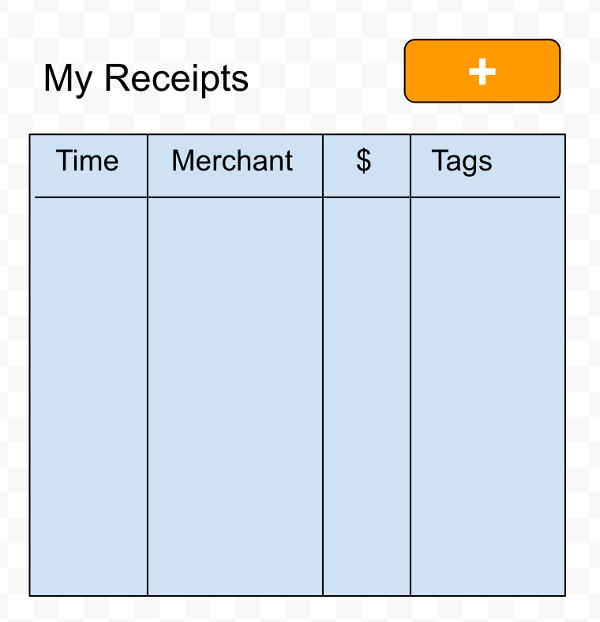

Assignment 3: Build a Single Page Application (20 Points)
---
*Due Sep 19 (Tuesday) at 11:58pm*

This assignment is the first step towards building a functional application for receipt
tracking and cataloging service.  The goal of this assignment
is to build a working HTML, CSS + Java Script single-page application that uses the
REST server you built in the last homework.

You will need to write and test the application, and ultimately deploy the application
to the cloud.

**No additional PR's are necessary unless you change your server url.**

To complete the assignment you must complete the following:
1. Build a SPA (Single Page Application) that conforms to the UI Spec
2. Integrate your SPA into your Server
3. Deploy the API to AWS

Do **NOT** use page auto-reload(e.g., using `location.reload()`) to refresh the changes. 
You are supposed to update the DOM elements on the fly using Javascript. 


*Important: Modern browser security restricts scripts running on particular
domains to that domain only.  If you are developing and encounter errors
regarding Mixed Media or Same-origin policy, you can cautiously consider
disabling security in your browser for development purposes.  To do this on OSX,
you must quit Chrome completely and then start Chrome from the command-line with special flags:*
```
 /Applications/Google\ Chrome.app/Contents/MacOS/Google\ Chrome --allow-running-insecure-content --args --disable-web-security --user-data-dir
```

If you have Firefox, you can use
[CORS](https://addons.mozilla.org/en-US/firefox/addon/cors-everywhere/) plugin,
that will allow to evade the browser security checks. Once installed you have to
activate it by clicking the small plugin icon on the status bar (top right,
probably). Remember to disable it when you are not testing your app---the
security checks in the browser are there for good reason and disabling them
with this plugin might be problematic. So use it carefully.


## 1. Building the SPA
Your assignment is to create a Single-Page Application that uses the API you
created in Assignment A2 to store and retrieve receipts, and add and delete tags.

To make the assignment to be *auto-grade-able*, you must follow specific conventions outlined
in this document with respect to the structure of your HTML and the use of class and id attributes
in specific locations.

Beyond these simple constraints, you are free to style and compose your application as you see fit:

#### Initial Sate


When your application opens, your application should query and display all receipts in the database.
Fields for Time, Merchant, Amount and tags are required.

0. All receipts should be under a `DIV` with the id `receiptList`. E.g., `<DIV id='receiptList'...</DIV>` node. 
1. Every receipt must be represented by a single element of the form `<DIV
   class="receipt">...</DIV>`.  The receipt element may have any internal structure you desire.
   Receipts must be selectable using `$('.receipt')`.

2. Every receipt must have the following fields available: `merchant`, `amount` and `tags`.
   * The merchant must be selectable using the following JQuery selector: `$('.merchant', $('.receipt')[0]).text()`.
   * The amount must be selectable using the following JQuery selector: `$('.amount', $('.receipt')[0]).text()`. Don't add any '$' or white spaces around the amounts in the column. 
   * The tags must be selectable using the following JQuery selector: `$('.tags', $('.receipt')[0]).text()`.

#### Add New Receipt


Clicking on the ‘add receipt’ button should add a receipt-entry node to the DOM that allows the user to enter a new receipt with merchant (required) and amount (optional) values.  Hitting ‘save’ will POST to the `/receipts` endpoint of your API.  Hitting `cancel` will close the form and discard any values entered.  Errors from the server should appear somewhere in the receipt-entry node so the user can understand and correct any problems.

1. The add button for receipts MUST have id `add-receipt` and be selectable via `$('#add-receipt')`.  A `click` event
fired on the element should show the add-receipt dialogue box.

2. You must use `INPUT` elements for the ‘merchant’ and ‘amount’ entry, and the `INPUT` elements must have id's `#merchant` and `#amount`.

3. The save and cancel button must have ids `save-receipt` and `cancel-receipt` and respond to `click` events.


#### Add Tags to Existing Receipts


The application supports the tagging of receipts with arbitrary user-defined tags.

* Every receipt row must have a button with class `add-tag` that responds to `click` events.  When clicked, an `INPUT` element with class `tag_input` must be added to the DOM **as a child of the receipt row upon which add-tag was clicked** and should be selectable by JQuery using `$('INPUT.tag_input', receiptNode)`.  The input element should execute a `PUT` request against your `PUT /tags/{tag}` API when the user strikes the `Enter` key in the `INPUT` element.

* The result of a successful `PUT` operation is the removal of the `tag_input` element from the DOM, and the addition of an element displaying the name of the tag now associated with the receipt.

* Tag elements must have a `tagValue` class attribute, and the value of the tags for a particular
  receipt must be selectable via e.g. `$('.tagValue', receiptNode)`

* Tag elements must respond to `click` events which execute a `PUT` request against your API to
  dissociate the receipt from the tag that was clicked.


## 2. Integrate the SPA into your Server
Adam will provide a snippet of code to support you in this regard. Update your [Skeleton](https://github.com/amfleming/skeleton) code from Adam's repo, and look at [this commit](https://github.com/amfleming/skeleton/commit/9a8925afa9756cad50a21d1cbf42f8d8deb66d4f).

## 3. Deploy to AWS
Exactly the same as we did in Assignment 02.

## 4. [Auto-grader](grade_a3.py)
Testing UI requires some extra maneuvers! We will use `Selenium` with `Firefox` browser to automate the testing.  
For this you have to do two things.   
1. install Python `selenium` library (`pip install selenium`),
2. download Firefox web driver from https://github.com/mozilla/geckodriver/releases, extract it, and copy the binary to your `PATH`.
   For Linux/OSX move that binary to `/usr/local/bin/'. For windows follow the detailed instruction given in http://selenium-python.readthedocs.io/installation.html.  

After this, run the [auto-grader script](grade_a3.py) as, 
```bash 
$ python grade_a3.py <your-url> 
``` 

E.g., `python grade_a3.py http://localhost:8080`

Let me know if you find issues in the code. 
Make sure your server is running! I used Python 3.6 to test the script in my machine.


