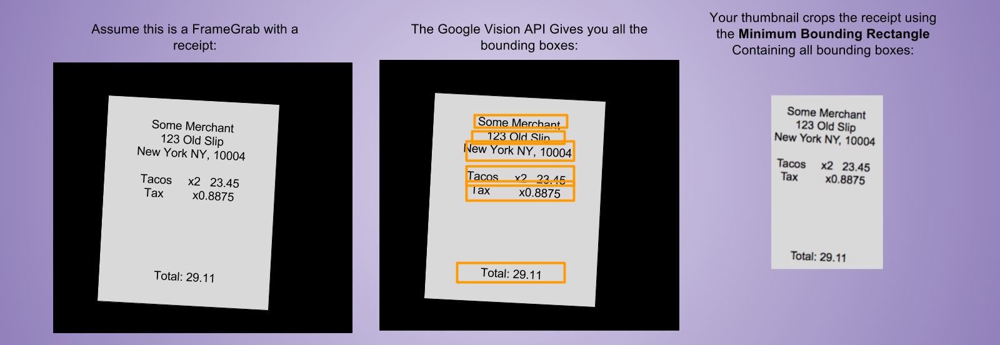

<!-- **NOT COMPLETE! A4 IS NOT RELEASED YET.** -->

# Assignment 4: Connect to Google Vision API (30 Points)

This is the last assignment for the course. We will finish our work of building a
receipt storing service by extending the functionality with Optical Character
Recognition (OCR) using [Google Cloud Vision
API](https://cloud.google.com/vision/).  The purpose of the OCR integration is to
speed the entry of receipts.  The output of successful OCR is suggestions for
new receipt creation, specifically `Merchant` and `Amount`.

**TL;DR**
The goal is to add a button to capture image of a receipt, process the image to
extract the merchant and the total amount, and prompt the user to add the
receipt with suggested merchant and amount from OCR.

## 0. Setup Google Vision API
   Here is a video of the steps required to create a service account, download
   the api key file, and enable the Google Vision API:
   [Setup Video](./setup.mp4).  **Restrict Access of your service key.** While
   creating the service key, click on the dropdown `Role`, and select `Roles` >
   `Role Viewer`.
   .
   The service account key, by default, has lot more permission than you want
   them to have. Restricting the role will ensure that the key is not misused.

   <!-- After this account with Google Cloud Platform, enable the Vision
   API. Follow -->
   <!-- the steps
   [here](https://cloud.google.com/functions/docs/tutorials/ocr). -->
   Fetch the updated [`Skeleton`](https://github.com/amfleming/skeleton) code, which is
   already updated with a controller for querying Vision API. You have to update
   it with correct `gc_api_file.json` that you downloaded form setup step above.
   Set the environment variable `GOOGLE_APPLICATION_CREDENTIALS=./gc_api_file.json`.
   In Linux, MAC, Windows Cygwin shell org Git Bash, this can be done by running `export
   GOOGLE_APPLICATION_CREDENTIALS=./gc_api_file.json`, just before calling `gradle run`.


## 1. Extracting merchant name and total price
   Google OCR will return the text recovered from the captured image.  From the
   returned text you have to extract the merchant name and the total price. We
   will use two simple heuristic to extract these information. Get the extracted
   text sorted vertically from top to bottom. Assume the top-most non-numerical
   text is the `merchant`, and the last decimal text (of the format `23.45`, or
   `43.00`) is the `total`.

   You must create the following endpoint, which accepts as input a `Base64`
   encoded string representing a PNG image, and returns a JSON object of the
   form `{"merchantName": ..., "amount": ...}`.


   Assuming you are running your server locally and you have a file containing a
   base-64-encoded PNG in `receipt_img.png.b64`, the following CURL request should
   succeed:
   ```
   curl  -H 'Content-Type: text/plain' --data "@./receipt_img.png.b64" localhost:8080/images
   ```

## 2. Capturing a photo of a receipt
   You should have a button your page (preferably beside the current add button
   for receipts) for starting the camera.  The button should be selectable by
   the selector `$('#start-camera')`. Clicking the button should start the
   camera.  There should be a button selectable by `$('#take-pic')`, clicking
   which will capture the photo. Also, once the `#take-pic` is clicked it should
   trigger a call to the backend to run OCR on the taken image using Google
   Vision API. Finally, you must destroy the `video` DOM element and transfer
   the suggestions from OCR into two user-editable inputs that show the results
   of the OCR parsing.  If the user is happy with the results, they should be
   able to add the new receipt with the suggestions (or modify the suggestions,
   or cancel).  It is reasonable to re-use your 'Add Receipt' form from A3 here.

   There should be a cancel button that should close the video and should cancel
   the process of adding a receipt. The id of that button should be
   `take-pic-cancel`.

   The UX for this assignment should follow 

   Code we wrote in class is [in this plnkr](https://plnkr.co/edit/yhAOTeADsTYeRcgqJ3hr?p=preview)

<!--
## 3. Submitting an image of a receipt
   In addition to capture an image, you should also support uploading an image
   of a receipt and process in the same way as said above. The button should
   have an id `upload-img`, and shouold be selectable by `$('#upload-img')` and
   respond to click event. The cacncel button should have id
   `upload-img-cancel`.
-->

## 3. Deploy in AWS
   Finally deploy your updated code in AWS.  Update the
   [`README.md`](../../README.md) **if and only if** your URL changed. We will
   grade your assignment using that URL you attached in the
   [`README.md`](../../README.md) file.

## 4. Testing + Auto grader
   - Chrome only allows access to devices (the camera) in Secure Contexts.  That means SSL-enabled websites, and when
     developing using `localhost`.  If you want to test your site once it is deployed, you will need to set a special
     flag unless you have configured SSL in order to get access to the camera
     ```
      /Applications/Google\ Chrome.app/Contents/MacOS/Google\ Chrome --unsafely-treat-insecure-origin-as-secure="http://your-site-url-here" --user-data-dir
     ```

   - To test using a specific receipt (OSX), you can set some special flags that feed a pre-defined
     video as the video device as below.
     (Sample receipts iinclude [receipt_vid.y4m](./receipt_vid.y4m) which should produce `{"merchantName":"Main","amount":29.01}` and
      [cappones.y4m](./cappones.y4m) which should produce `{"merchantName":"Cappones","amount":28.86}`)
     ```
      /Applications/Google\ Chrome.app/Contents/MacOS/Google\ Chrome --use-fake-device-for-media-stream --use-file-for-fake-video-capture=receipt_vid.y4m  --user-data-dir
     ```
   - Autograder. [http://ec2-54-204-181-13.compute-1.amazonaws.com:8080/](http://ec2-54-204-181-13.compute-1.amazonaws.com:8080/).
     This time we are using online autograder. Please don't destroy the tiny feeble auto-grader server!
     
     You can also run it locally, in case the remote server does not work.  You have to install `node` and `npm`, then go 
     into this 
     project directory. `assignments/a4/`. Run `npm install .` to install the dependencies. 
     ```bash
     $ node grade_a4.js --url <your-url> --tests add_receipt_by_snap add_tag del_tag
     ```
     
     
## 5. Retain old functionalities.
   Please make sure that your server have all the functionalities specified in A2 and A3, especially `/netid` endpoint.
   

#  Extra Credit
Two forms of extra credit are possible on this assignment.

## EC1. Custom Domain (+3 pts)
Purchase a custom domain for your application and setup DNS. [[Tutorial](http://docs.aws.amazon.com/Route53/latest/DeveloperGuide/routing-to-ec2-instance.html)]
Your DNS configuriation should create an `A Record` that points to your ECS instance.

... Unless of course you choose to setup SSL!  In which case:

## EC2. Setup SSL (+5 pts)
Setup a load balancer for your application (ALB or ELB).  Use  Amazon
[AWS Certificate Manager](https://aws.amazon.com/blogs/aws/new-aws-certificate-manager-deploy-ssltls-based-apps-on-aws/)
to generate an SSL Certificate.  Apply the certificate to the
load balancer.  To get credit for this, Chrome must display a
Green Lock when your site is loaded:


To get credit for SSL, **you must also setup a custom domain**
You cannot get credit for SSL without setting up a custom domain.

## EC3. Thumbnails (+12 pts)
For receipts created via image capture, crop the image used for OCR
and display it in your app as a thumbnail.

To determine the cropping dimensions, you must compute the *Minimum Bounding Rectangle* that
includes all the OCR-recognized text.  Crop to the *MBR* and display the cropped image
in your application.  Visually the method for determining appropriate crop is below:


